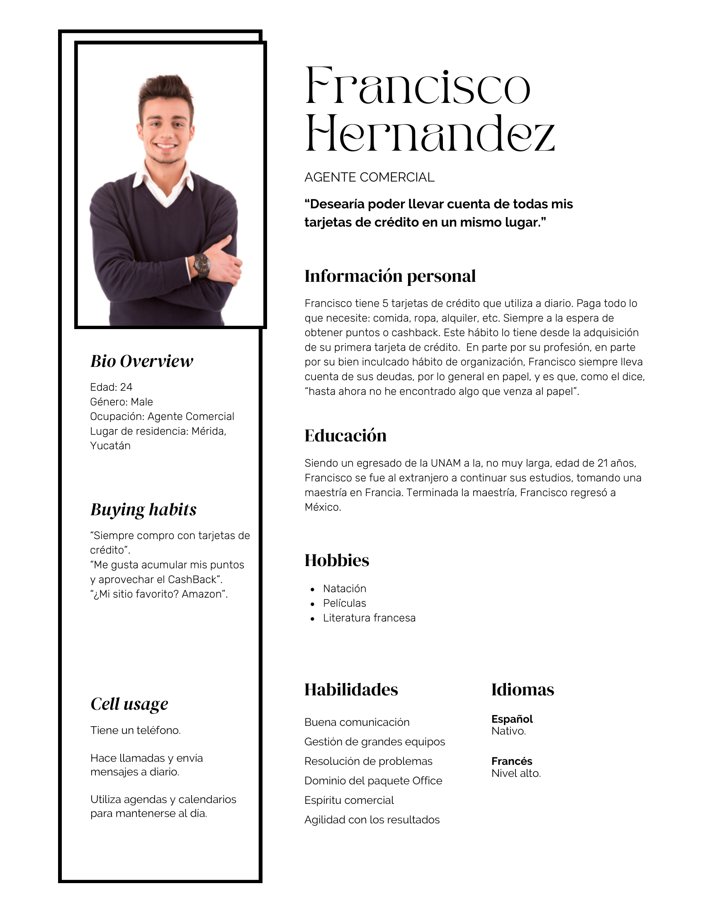
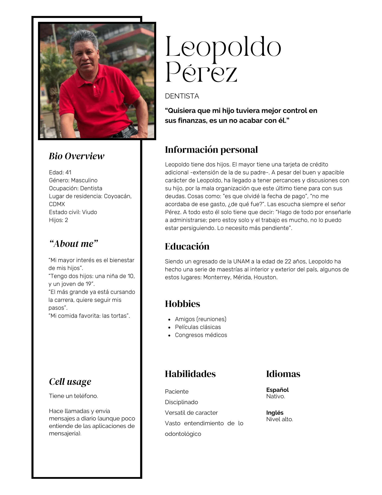

# User Modeling
El user modeling consiste en crear representaciones estructuradas que guíen el diseño y la interacción. Lo más idoneo para el proyecto es el uso de personas

## Personas
Es una representación ficticia de usuarios reales basadas en el user research. 

### Primary User

### Secondary User

## Escenario: Francisco evita intereses con ayuda de la app  

### Contexto  
- **Usuario:** Francisco, 24 años, agente comercial.  
- **Situación:** Tiene 5 tarjetas de crédito de distintos bancos.  
- **Problema:** No quiere olvidar pagos, pero no desea depender de notas en papel.  

---

### Flujo de interacción dentro de la aplicación  

1. **Inicio de sesión**  
   - Francisco abre la app desde su celular.  
   - Ingresa con huella digital para entrar rápido.  

2. **Pantalla principal (Dashboard)**  
   - Ve un **resumen consolidado**:  
     - Total de deuda.  
     - Pago mínimo y pago total de cada tarjeta.  
     - Un aviso destacado en rojo: *“La tarjeta Bancomer vence mañana. Pago total: $3,500 MXN”*.  

3. **Detalle de tarjeta**  
   - Francisco toca la tarjeta Bancomer.  
   - La app muestra:  
     - Fecha de corte.  
     - Fecha límite de pago.  
     - Saldo actual.  
     - Monto mínimo y monto total a pagar.  
   - Francisco toma nota mental y abre la app del banco más tarde para hacer el pago.  

4. **Calendario integrado**  
   - Francisco abre la sección de calendario.  
   - Ahí ve todas las fechas de corte y vencimiento de sus 5 tarjetas en un solo lugar.  
   - Observa que otra tarjeta vence en 10 días, y programa un recordatorio.  

5. **Notificación push**  
   - Antes de cerrar la app, activa la opción: *“Recordarme mañana a las 9 am sobre el pago de Bancomer”*.  
   - La app guarda el recordatorio.  

6. **Cierre y seguimiento**  
   - Francisco cierra la aplicación.  
   - Al día siguiente recibe la notificación push: *“Hoy vence tu tarjeta Bancomer. Pago total: $3,500 MXN”*.  
   - Con esa alerta, abre la **app del banco** y realiza el pago desde ahí.  
   - Después vuelve a la app de gestión y marca la deuda como *“Pagada”* para mantener actualizado su registro.  

---

### Resultado  
- Francisco no olvida el pago de la tarjeta.  
- Tiene una **visión clara y anticipada** de los siguientes vencimientos.  
- Se siente en control porque todo está en un solo lugar, sin depender de papeles ni memorias.  

---

### Principios HCI aplicados  
- **Prevención de errores:** notificaciones y calendario evitan olvidos.  
- **Eficiencia cognitiva:** ya no debe revisar 5 apps distintas de bancos, todo está centralizado.  
- **Satisfacción:** la interfaz le da seguridad y orden, aunque la acción de pagar ocurre fuera de la app.  

